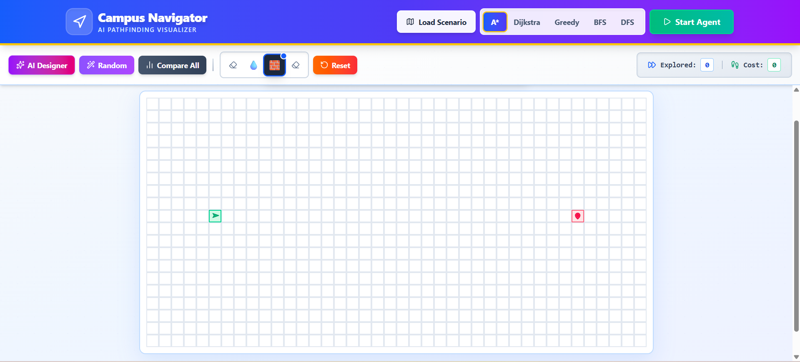
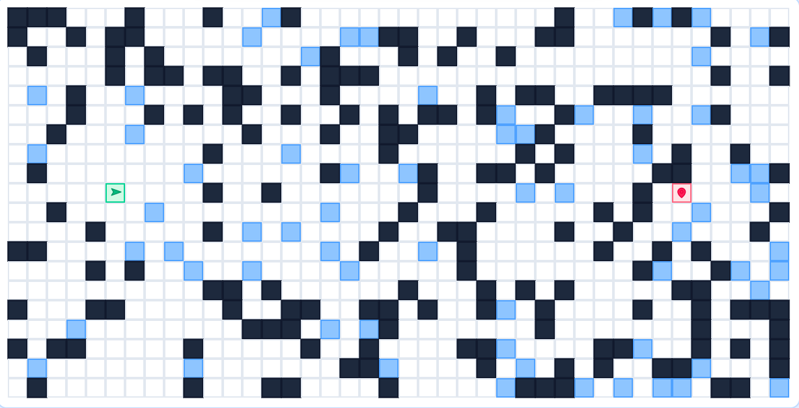
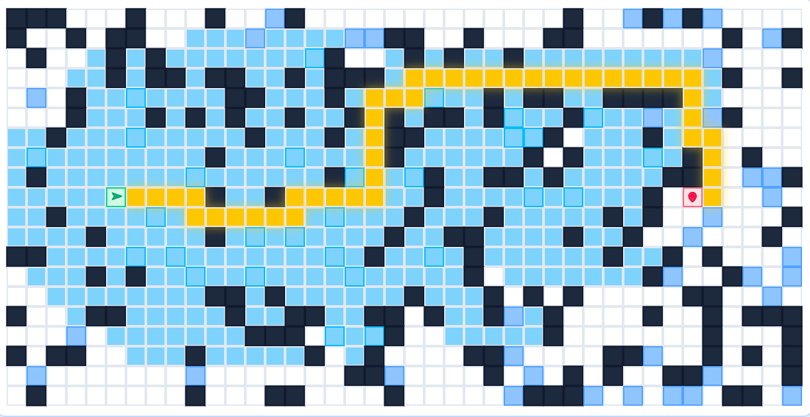
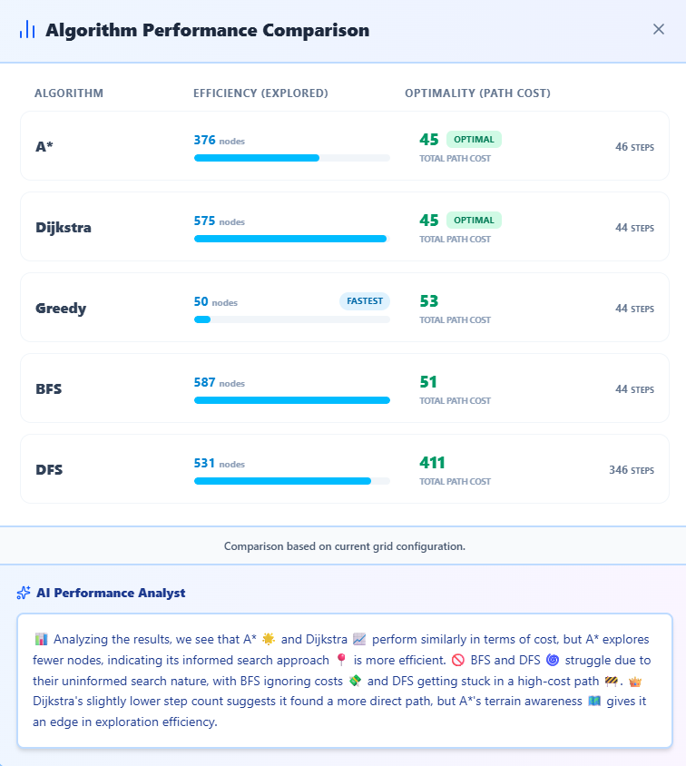

# 🎓 Campus Navigator — AI Pathfinding Visualizer

An interactive AI-powered pathfinding visualizer that simulates and compares search algorithms on dynamic grid environments. Built with React + Vite, it enables real-time visualization, AI-based map generation, and performance analysis.

---

## 🌐 Live Demo

🚀 [[https://your-vercel-link.vercel.app](https://campusnavigator-249h.onrender.com/)](https://campusnavigator-249h.onrender.com/) 

---

## 📸 Screenshots

### 🧠 Main Interface  

### 🚧 Obstacles  

### 🤖 Solution 

### 📊 Algorithm Comparison  

---

## ✨ Key Features

### 🔍 Pathfinding Algorithms
- A* (Optimal, heuristic-based)  
- Dijkstra (Guaranteed shortest path)  
- Greedy BFS (Fast, non-optimal)  
- BFS (Unweighted graphs)  
- DFS (Depth-first exploration)  

---

### 🎨 Interactive Grid System
- Draw walls, water, and paths  
- Drag & drop start/end nodes  
- Real-time animations  
- Works on desktop + mobile  

---

### 🤖 AI-Powered Features
- Generate maps using natural language (Llama 3.3)  
- Convert images to grids (Llama Vision)  
- AI-based performance insights  

---

### 📊 Performance Analytics
- Compare all algorithms side-by-side  
- Metrics: nodes explored, cost, efficiency  
- Visual graphs + AI explanations  

---

### 🌍 Preset Scenarios
- Campus Map  
- City Traffic Grid  
- Jungle Terrain  
- Metro Network  
- Mountain Path  

---

## 🛠 Tech Stack

- React  
- Vite  
- Tailwind CSS  
- JavaScript  
- Groq API  

---

## 🚀 Getting Started

### 1. Clone repository
git clone https://github.com/IshaanSaxena2005/Campus-Navigator.git  
cd Campus-Navigator  

### 2. Install dependencies
npm install  

### 3. Run project
npm run dev  

---

## 🔐 Environment Setup

Create a `.env` file in root:

VITE_GROQ_API_KEY=your_api_key_here  

---

## 📁 Project Structure

src/  
 ├── App.jsx  
 ├── main.jsx  
 ├── assets/  
 ├── styles/  
public/  
index.html  

---

## 🚧 Future Improvements

- Add diagonal movement  
- More algorithms (JPS, Bidirectional A*)  
- Save/load maps  
- Dark mode  
- Export maps  

---

## 👨‍💻 Authors

- Ishaan Saxena  
- Hardesh Agarwal  

---

## 📌 Note

This is an educational/demo project. No real user data is collected.

---
